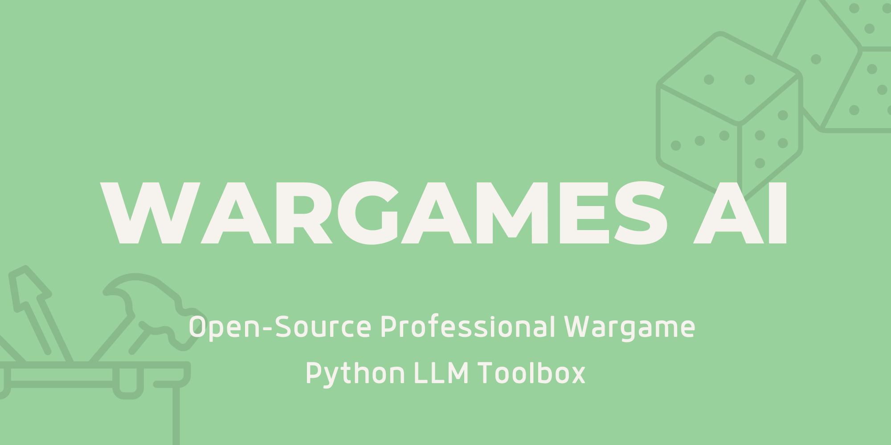

<p align="center">
    
  </a>
</p>
<p align="center"> 🤖 Professional Wargaming LLM Toolbox🎲 </p>

WargamesAI is a toolkit designed to help you quickly create and run, test, and play wargames using Large Language Model agents. 

# 🎲 What Can WargamesAI Do for You?
- **Rapid Prototyping:** Quickly generate scenarios, rules, and agents to test out ideas.
- **Scalable Games:** Run large-scale wargames with dozens or even hundreds of AI agents, enabling you to explore scenarios that would be impractical with human players.
- **AI-Driven Play:** Let AI agents in silo or alongside human players interact with the Umpire to facilitate the wargame. 

WargamesAI uses Large Language Models (LLMs) to simulate reasoning and decision-making for your agents. These models generate responses and actions based on the scenarios you create, providing realistic and dynamic gameplay. WargamesAI key features, include:

- LLM facilitates Umpiring.
- LLM or Human players.
- Automatic generation of games, scenarios, rules, rounds, and players using LLMs.
- LLM-guided game summarisation.
- Dice and Card integration.
- Extraction of LLM agent personalities from text or PDFs.

# 🧠 LLM Reasoning
LLMs reason by predicting the most probable next word in a sequence based on the context provided. They use transformer architectures with attention mechanisms to capture relationships between words and phrases across long text sequences. This allows them to generate responses that follow logical and grammatical structures similar to human language use. While their outputs can mimic human reasoning patterns—such as drawing inferences, answering questions, or providing explanations—they do so without genuine comprehension or awareness. Their "reasoning" is a result of pattern recognition and statistical associations formed during training on large datasets, rather than conscious thought processes. 

In the case of wargaming this means that LLMs can provide In the case of wargaming, this means that LLMs can provide valuable simulations and strategic analyses by generating plausible scenarios, potential outcomes, and tactical suggestions based on patterns learned from extensive military and historical data. However, while they can mimic human reasoning in crafting strategies and forecasting developments, they lack true understanding and cannot account for unpredictable human factors or novel situations without prior data representation. Therefore, their use in wargaming can augment human expertise but should not replace the nuanced judgment of experienced strategists.

# 🎌 Scenario: Moroccan Crisis of 1905-1906
This game focuses on the Moroccan Crisis of 1905-1906, a key event in the lead-up to World War I. Players represent the major powers involved, and their actions influence the diplomatic and military landscape of Europe. The game culminates in Germany's decision on whether to escalate the crisis or pursue diplomacy.

```python
from WargamesAI.coordination import Umpire, Game, GameRunner
from WargamesAI.agents import Agent
from pprint import pprint

# Define the actions for the first round (abstract and broad)
france_turn_1 = {"TEAM": "FRANCE", "PLAYER": "France", "ACTIVITY": "Assert influence over Morocco through diplomatic or economic means."}
germany_turn_1 = {"TEAM": "GERMANY", "PLAYER": "Germany", "ACTIVITY": "Challenge French influence in Morocco by diplomatic or military posturing."}
uk_turn_1 = {"TEAM": "UNITED KINGDOM", "PLAYER": "United Kingdom", "ACTIVITY": "Decide whether to support France diplomatically or remain neutral."}
austria_turn_1 = {"TEAM": "AUSTRIA-HUNGARY", "PLAYER": "Austria-Hungary", "ACTIVITY": "Support Germany diplomatically or try to mediate the crisis."}

# Define the actions for the second round (continuation with broad actions)
france_turn_2 = {"TEAM": "FRANCE", "PLAYER": "France", "ACTIVITY": "Negotiate with other powers to secure their support or prepare for potential conflict."}
germany_turn_2 = {"TEAM": "GERMANY", "PLAYER": "Germany", "ACTIVITY": "Seek alliances or escalate the situation to assert dominance in the region."}
uk_turn_2 = {"TEAM": "UNITED KINGDOM", "PLAYER": "United Kingdom", "ACTIVITY": "Strengthen diplomatic ties with France or reconsider neutrality."}
austria_turn_2 = {"TEAM": "AUSTRIA-HUNGARY", "PLAYER": "Austria-Hungary", "ACTIVITY": "Decide whether to deepen support for Germany or advocate for a diplomatic solution."}

# Combine the rounds into a structure
round = [france_turn_1, germany_turn_1, uk_turn_1, austria_turn_1, france_turn_2, germany_turn_2, uk_turn_2, austria_turn_2]

# Create the final decision round
germany_final_round = [{"TEAM": "GERMANY", "PLAYER": "Germany", "ACTIVITY": "Decide whether to escalate the crisis into a full conflict or seek a diplomatic resolution."}]

# Define the game structure with multiple rounds leading to the final decision
game_rounds = [round, round, round, round, germany_final_round]

# Define the game with rules focused on diplomatic maneuvering and brinkmanship
game = Game(
    rounds=game_rounds,
    game_rules_text="This game focuses on the Moroccan Crisis of 1905-1906, a key event in the lead-up to World War I. Players represent the major powers involved, and their actions influence the diplomatic and military landscape of Europe. The game culminates in Germany's decision on whether to escalate the crisis or pursue diplomacy.",
    rules_folder="./rules"
)

# Create agents for the game
france = Agent(game, deployment_directive="You are the representative of France, aiming to maintain and strengthen your influence in Morocco.", factions=["FRANCE"], beliefs=["French colonial interests are paramount"], disposition="determined", empathy="medium", exercise_objectives=["To secure Moroccan influence through diplomacy or force"], strategic_objectives=["To avoid war while preserving French interests"], bio_folder="./bios")
germany = Agent(game, deployment_directive="You are the representative of Germany, challenging French dominance in Morocco and seeking to expand German influence.", factions=["GERMANY"], beliefs=["Germany deserves a 'place in the sun'"], disposition="assertive", empathy="low", exercise_objectives=["To undermine French influence in Morocco"], strategic_objectives=["To strengthen Germany's international position without provoking a full-scale conflict"], bio_folder="./bios")
uk = Agent(game, deployment_directive="You are the representative of the United Kingdom, deciding whether to support France or maintain neutrality.", factions=["UNITED KINGDOM"], beliefs=["British interests are global, not just European"], disposition="cautious", empathy="high", exercise_objectives=["To maintain European stability"], strategic_objectives=["To prevent a major conflict while keeping France as an ally"], bio_folder="./bios")
austria = Agent(game, deployment_directive="You are the representative of Austria-Hungary, balancing support for Germany with the desire to avoid war.", factions=["AUSTRIA-HUNGARY"], beliefs=["Austria must support Germany as an ally"], disposition="pragmatic", empathy="medium", exercise_objectives=["To support Germany diplomatically"], strategic_objectives=["To avoid escalating the situation into a broader conflict"], bio_folder="./bios")

# Add the agents to their respective teams
game.add_team("FRANCE", [{"France": france}])
game.add_team("GERMANY", [{"Germany": germany}])
game.add_team("UNITED KINGDOM", [{"United Kingdom": uk}])
game.add_team("AUSTRIA-HUNGARY", [{"Austria-Hungary": austria}])

# Initialize the Umpire and GameRunner
umpire = Umpire(game)
runner = GameRunner(game, umpire)

# Run the game rounds
pprint(runner.run_all_rounds())

# Produce the summary and determine the winner
pprint(umpire.produce_summary())
pprint(umpire.deduce_winner())
```

Example LLM summarisation of full game:
```
The Moroccan Crisis is underway, with France asserting its influence, Germany challenging that influence through diplomatic posturing and support from allies like Austria-Hungary. The United Kingdom, while  aligning with France due to the entente, is also focused on communication and mediation to avoid conflict escalation. The players are actively negotiating, seeking support, displaying military strength, and attempting to shape the international response to the crisis.  The ultimate outcome, whether Germany escalates or pursues diplomacy, remains uncertain.
```

# ⚙️ Setup
Tomato required Nvidia CUDA. Follow the steps below:
- Ensure your Nvidia drivers are up to date: https://www.nvidia.com/en-us/geforce/drivers/
- Install the appropriate dependancies from here: https://pytorch.org/get-started/locally/
- Validate CUDA is installed correctly by running the following and being returned a prompt ```python -c "import torch; print(torch.rand(2,3).cuda())"```
  
Install the dependencies using:

```bash
git clone https://github.com/user1342/WargamesAI.git
cd WargamesAI
pip install -r requirements.txt
pip install -e .
```
or
```bash
pip install git+https://github.com/user1342/WargamesAI.git
```

# 📚 Examples

## Creating an LLM player from a PDF
```python
# Example: Creating an Agent with a PDF Bio
pdf_agent = Agent(
    game=icebreaker_game,
    pdf_bio="path/to/bio.pdf",
    bio_folder="./bios"
)
```

## Creating a Game from a rules PDF
```python
# Example: Creating a Game with PDF Rules
pdf_rules_game = Game(
    rounds=icebreaker_rounds,
    game_rules_pdf="path/to/rules.pdf",
    teams={"Polar Alliance": polar_alliance_agents, "Arctic Consortium": arctic_consortium_agents}
)
Changing the Model Used for Agents and Umpire
WargamesAI allows you to customize the AI models used by your agents and umpire. You might want to change the model to fit different scenarios or performance needs.

```

## Setting custom models for the player character agents
```python
# Example: Using a Different Model for an Agent
custom_model_agent = Agent(
    game=icebreaker_game,
    deployment_directive="Lead negotiations to secure strategic resources.",
    factions=["Diplomatic Corps"],
    beliefs=["Peaceful resolution", "Economic benefit"],
    disposition="Diplomatic",
    empathy="High",
    exercise_objectives=["Achieve a treaty"],
    strategic_objectives=["Secure resources without conflict"],
    model_name="unsloth/mistral-7b-instruct-v0.3",  # Custom model
    bio_folder="./bios"
)
```

## Setting custom models for Umpire role
```python
# Example: Using a Different Model for the Umpire
custom_model_umpire = Umpire(
    game=icebreaker_game,
    model_name="unsloth/Llama-2-7b-bnb-4bit",  # Custom model
    max_tokens=800
)
```

## Rolling Dice [Experimental]
```python
# Example: Rolling Dice
dice_result = umpire.roll_dice(highest=6, times=2)  # Rolling two 6-sided dice
print(f"Dice roll result: {dice_result}")
```

## Drawing Cards [Experimental]
```python
# Example: Drawing Cards
cards = ["Sabotage", "Reinforcements", "Diplomatic Pressure"]
drawn_cards = umpire.pick_card(number=2)  # Drawing two cards from the deck
print(f"Drawn cards: {drawn_cards}")
```

## 🤖 Models
At current, the following models have been tested with WargamesAI:
- unsloth/Llama-3.1-Storm-8B-bnb-4bit
- unsloth/mistral-7b-instruct-v0.3
- unsloth/gemma-2-9b-it-bnb-4bit

# 🙏 Contributions
WargamesAI is an open-source project and welcomes contributions from the community. If you would like to contribute to WargamesAI, please follow these guidelines:

- Fork the repository to your own GitHub account.
- Create a new branch with a descriptive name for your contribution.
- Make your changes and test them thoroughly.
- Submit a pull request to the main repository, including a detailed description of your changes and any relevant documentation.
- Wait for feedback from the maintainers and address any comments or suggestions (if any).
- Once your changes have been reviewed and approved, they will be merged into the main repository.

# ⚖️ Code of Conduct
WargamesAI follows the Contributor Covenant Code of Conduct. Please make sure to review and adhere to this code of conduct when contributing to Tomato.

# 🐛 Bug Reports and Feature Requests
If you encounter a bug or have a suggestion for a new feature, please open an issue in the GitHub repository. Please provide as much detail as possible, including steps to reproduce the issue or a clear description of the proposed feature. Your feedback is valuable and will help improve WargamesAI for everyone.

# 📜 License
 GPL-3.0 license
